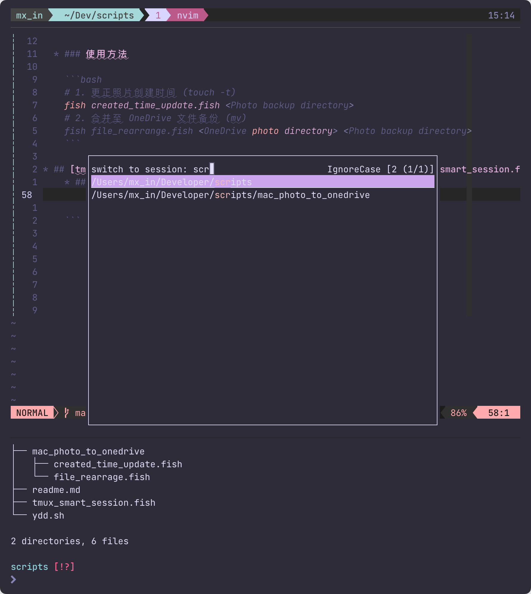

# Scripts

* ## [tmux_smart_session](https://github.com/mx-in/scripts/blob/main/tmux_smart_session.fish)

    

    更简单的方式去创建 / 切换 tmux session。

    使用 zoxide 作为数据源，将工作路径作为 session 名进行创建，切换。
    * ### 依赖
        * [zoxide](https://github.com/ajeetdsouza/zoxide)
        * [pathshorten](https://github.com/mx-in/pathshorten)
        * [fish-shell](https://github.com/fish-shell/fish-shell)

    * ### 使用方法  

        ```fish
        tmux_smart_session --init <working directory path>
        ```

    没有初始参数将尝试打开最近工作的 session

    * ### 快捷键配置
        
        ```
        #fish Ctrl + t
            bind \ct "fish -c \"tmux_smart_session --init \$PWD\""
        #tmux Prefix + S open a float window
            bind -r S display-popup -d '#{pane_current_path}' -E -w70% -h50% "fish -c \"tmux_smart_se
        ```
* ## [生成 .gitignore](https://github.com/mx-in/scripts/blob/main/gi.fish)
    * ### 依赖
        * [fish-shell](https://github.com/fish-shell/fish-shell)
        * [curl](https://github.com/curl/curl)
        * https://www.toptal.com/developers/gitignore/api
    * ### 使用方法
        ```shell
        # gi vim,macOS,fish > .gitignore
        gi <enviroment, dependencies...> .gitignore
        ```
    
* ## [Youtobe 视频下载并转换为音频](https://github.com/mx-in/scripts/blob/main/ydd.sh)
  
    * ### 依赖：
        * [youtube-dl](https://youtube-dl.org/)
        * [ffmpeg](https://youtube-dl.org/)
        * [bash](https://youtube-dl.org/)
    * 使用方法：
    
    ```bash
    # ydd <youtube url> <start-time> <end-time> <file-name>
    bash ydd.sh https://www.youtube.com/watch\?v\=jf6oMCCX0uw\&ab_channel\=dailydictation 00:49 00:4 dd-555
    ```
    
* ## [备份 MacOS 下 Photo 中照片至 OneDrive](https://github.com/mx-in/scripts/tree/main/mac_photo_to_onedrive)

  * ### 使用 Photo 存在的问题：

    1. Photo 在创建备份时将照片的创建时间改为了备份时间

    2. Photo 导出的文件结构和 OneDrive 不同无法简单合并。

       * Photo 目录结构

         ```
         2014年7月20日/
         └── xxx.jpg
         2015年2月1日/
         ├── xxx.jpg
         └── xxx.jpg
         ```

       * OneDrive 结构

         ```
         2016/
         ├── 03
         │   ├── xxx.jpg
         │   └── xxx.jpg
         └── 04
             └──xxx.jpg
         2006/
         └── 04
             └── xxx.jpg
         ```

  * ### 依赖：
    [fish-shell](https://github.com/fish-shell/fish-shell)

  * ### 使用方法

    ```bash
    # 1. 更正照片创建时间 (touch -t)
    fish created_time_update.fish <Photo backup directory>
    # 2. 合并至 OneDrive 文件备份 (mv)
    fish file_rearrange.fish <OneDrive photo directory> <Photo backup directory>
    ```
  
